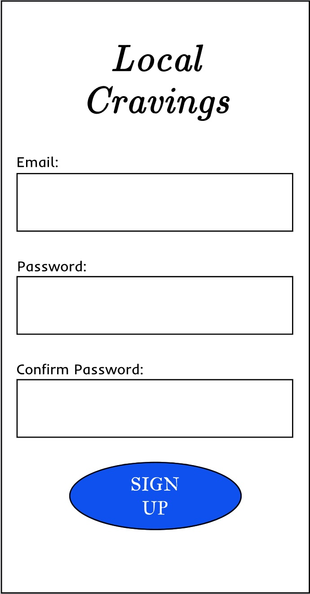
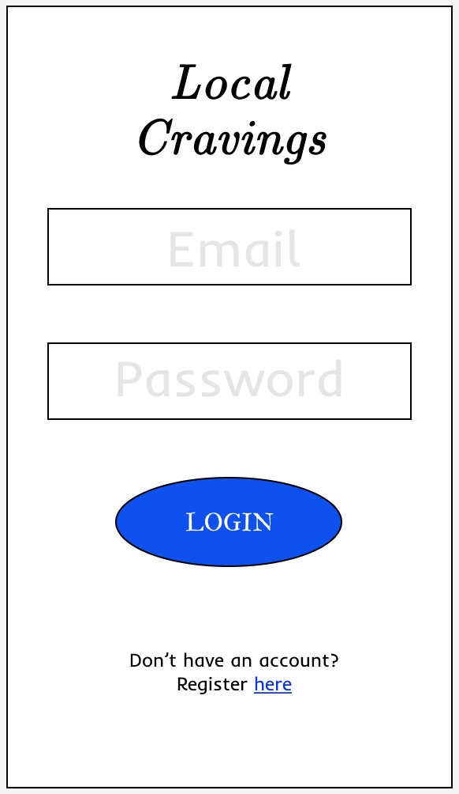
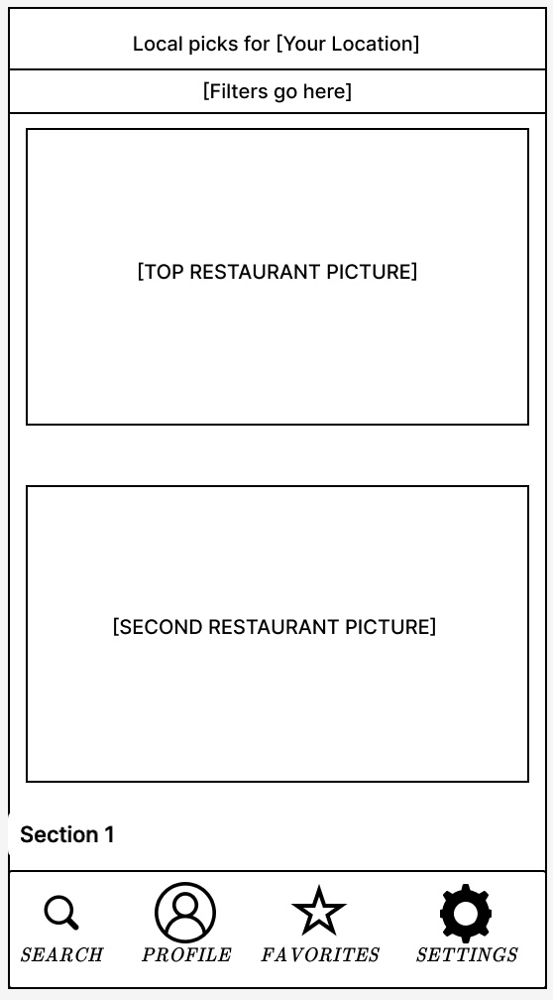

# Local Cravings
### Made by:
---
#### Jeffrey Sheets
#### Isaiah Sabin
#### Gabriel Bushong
---

## 1 Introduction

Everyone has cravings when they are hungry. But when you're on vacation you don't want a large corporate chain that you've been to a thousand times, that's where **Local Cravings** comes in. This app gathers all the local restaurants in your area and shows them to you. You can filter out restraunts based on their star rating, what food they offer, and other aspects that may dictate where you'll go.

## 2 Architectural Design

**Local Cravings** will be primarily programmed in Kotlin. While we will also utilize googles placeID API to aquire the information on restraunts in a certain area. For the server side the app will use Firebase to store information like the profiles of the users and which restaurants they have favorited.

### 2.1 Sequence Diagram

  
   
   
  Figure 1: The registration screen

### 2.2 Class Diagram

  
   
   
  Figure 1: The registration screen

### 2.3 Communication Diagram

  
   
   
  Figure 1: The registration screen

## 3 User Guide

### 3.1 Client Side

#### 3.1.1 Starting the Application
Once the user has downloaded the app onto their android device, an icon will appear on their home screen. From there they can click on their icon where they will be presented with the login screen which will prompt them to create an account if they don't already have one.

#### 3.1.2 Registration
In the registration screen the user can enter their email once and their password twice. This information will create a new account in the firbase database where all their information will be stored.

  
   
   
  Figure 1: The registration screen

#### 3.1.3 Login
As stated before the login screen prompts the user to register for an account if they don't have one. When the user enters their credentials they are compared to the ones on in firebase and if they are found they will log the user in with all of their saved information.

  
   
   
  Figure 1: The Login screen

#### 3.1.4 Dashboard
The dashboard will use googles placeID API to find the users location and it will display the location at the top of the screen. Below that will be the option to filter out restaurants based on certain criteria like food type, distance, and star rating. Under that it will display the pictures of the restaurants that you can scroll through and choose which one you want to look at. Finally there are selections at the bottom of the screen to search for specific restaurants, the profile of the user, the restaurants the user has favorited, and the settings for the app.

  
   
   
  Figure 1: The Dashboard

#### Risk Analysis and Retrospection
The risks for this project were pretty great. I believe the scope of the project was too great and my expectations were too high. The biggest problems when working on this project was not only the scope but the use of third party software like Firebase and Googles PlaceID API. These were too complex and resulted in too many bugs for us to handle in the short time for this project. In the end there should have been much more time devoted to working out bugs. Communication and planning were also severly lacking for this project. This project is not complete due to the many faults I listed before. The only things that were done were the Login, Registration, and certain aspects of the Dashboard. Things like the Favorite button, the search bar, and even the list of restaurants have all gone unfinished.
#### Planning for the project

Jira: https://cis350project.atlassian.net
